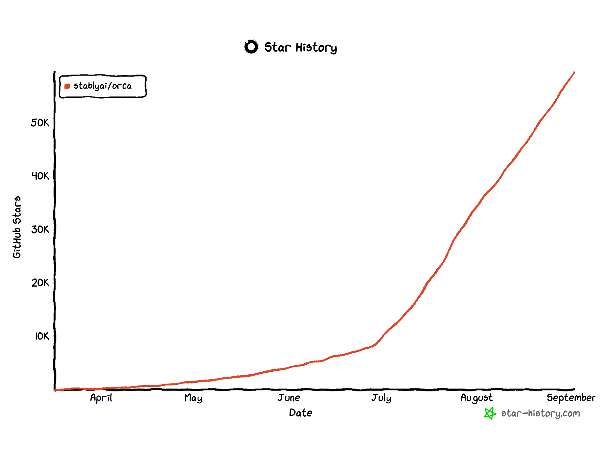

<h1 align="center">
  <a href="https://onOrca.dev"></a> Girra
</h1>

<p align="center">
  <a href="https://github.com/stablyai/orca"></a>
  <a href="https://github.com/stablyai/orca/releases"></a>
  
  <a href="https://discord.gg/fzjDKHxv8Q"></a>
  <a href="https://x.com/orca_build"></a>
  
</p>

<p align="center">
  <sub><a href="../../README.md">English</a> · <a href="README.zh-CN.md">中文</a> · <a href="README.ja.md">日本語</a> · <a href="README.ko.md">한국어</a> · <a href="README.es.md">Español</a> · <a href="README.pt.md">Português</a></sub>
</p>

<p align="center">
  <strong>L'orchestrateur d'IA pour les builders 100x.</strong><br/>
  Lancez Claude Code, OpenCode ou Pi côte à côte — chacun dans son propre worktree, le tout suivi au même endroit.
</p>

<h3 align="center"><a href="https://onorca.dev/download"><ins>Télécharger Girra</ins></a></h3>

<p align="center">
  <sub>Sous Windows ? Prenez la <a href="https://github.com/stablyai/orca/releases#release-v1.4.147-rc.3">dernière RC</a> — elle inclut des correctifs Windows.</sub>
</p>

<p align="center">
  
</p>

## Fonctionnalités

<table>
<tr>
<td width="50%" valign="middle">

### Worktrees parallèles

Lancez un même prompt sur cinq agents, chacun dans son propre worktree git isolé — comparez les résultats et mergez le gagnant.

[Docs →](https://www.onorca.dev/docs/model/worktrees)

</td>
<td width="50%">
  <a href="https://www.onorca.dev/docs/model/worktrees"><picture><source srcset="../assets/feature-wall/parallel-worktrees.gif" type="image/gif"></picture></a>
</td>
</tr>
<tr>
<td width="50%" valign="middle">

### Splits de terminal

Terminaux de niveau Ghostty avec rendu WebGL, splits infinis et un scrollback qui survit aux redémarrages.

[Docs →](https://www.onorca.dev/docs/terminal)

</td>
<td width="50%">
  <a href="https://www.onorca.dev/docs/terminal"><picture><source srcset="../assets/feature-wall/terminal-splits.gif" type="image/gif"></picture></a>
</td>
</tr>
<tr>
<td width="50%" valign="middle">

### Mode Design

Cliquez sur n'importe quel élément d'UI dans une vraie fenêtre Chromium pour envoyer son HTML, son CSS et une capture recadrée directement dans le prompt de votre agent.

[Docs →](https://www.onorca.dev/docs/browser/design-mode)

</td>
<td width="50%">
  <a href="https://www.onorca.dev/docs/browser/design-mode"><picture><source srcset="../assets/feature-wall/design-mode.gif" type="image/gif"></picture></a>
</td>
</tr>
<tr>
<td width="50%" valign="middle">

### GitHub &amp; Linear, natifs

Parcourez PRs, issues et boards de projet dans l'app — ouvrez un worktree depuis n'importe quelle tâche et reviewz sans changer de contexte.

[Docs →](https://www.onorca.dev/docs/review/linear)

</td>
<td width="50%">
  <a href="https://www.onorca.dev/docs/review/linear"><picture><source srcset="../assets/feature-wall/github-linear.gif" type="image/gif"></picture></a>
</td>
</tr>
<tr>
<td width="50%" valign="middle">

### Worktrees SSH

Faites tourner des agents sur une machine distante costaude, avec édition de fichiers, git et terminaux complets — reconnexion auto et port forwarding inclus.

[Docs →](https://www.onorca.dev/docs/ssh)

</td>
<td width="50%">
  <a href="https://www.onorca.dev/docs/ssh"><picture><source srcset="../assets/feature-wall/ssh-worktrees.gif" type="image/gif"></picture></a>
</td>
</tr>
<tr>
<td width="50%" valign="middle">

### Annoter les diffs IA

Posez des commentaires sur n'importe quelle ligne de diff et renvoyez-les à l'agent — review, édition et commit sans quitter Girra.

[Docs →](https://www.onorca.dev/docs/review/annotate-ai-diff)

</td>
<td width="50%">
  <a href="https://www.onorca.dev/docs/review/annotate-ai-diff"><picture><source srcset="../assets/feature-wall/annotate-diff.gif" type="image/gif"></picture></a>
</td>
</tr>
<tr>
<td width="50%" valign="middle">

### Glisser-déposer vers les agents

L'éditeur VS Code avec autosave partout — glissez fichiers ou images directement dans le prompt d'un agent.

[Docs →](https://www.onorca.dev/docs/editing/file-explorer)

</td>
<td width="50%">
  <a href="https://www.onorca.dev/docs/editing/file-explorer"><picture><source srcset="../assets/feature-wall/file-drag.gif" type="image/gif"></picture></a>
</td>
</tr>
<tr>
<td width="50%" valign="middle">

### Girra CLI

Les agents pilotent aussi Girra — scriptez n'importe quel workflow avec `girra worktree create`, `snapshot`, `click` et `fill`.

[Docs →](https://www.onorca.dev/docs/cli/overview)

</td>
<td width="50%">
  <a href="https://www.onorca.dev/docs/cli/overview"><picture><source srcset="../assets/feature-wall/orca-cli.gif" type="image/gif"></picture></a>
</td>
</tr>
</table>

**Aussi dans la boîte :**

- **[Quick open](https://www.onorca.dev/docs/model/quick-open)** — Cherchez parmi worktrees, fichiers, agents, commandes et contexte du repo sans quitter votre flow.
- **[Sélecteur de comptes &amp; suivi d'usage](https://www.onorca.dev/docs/agents/usage-tracking)** — Suivez l'usage Claude et les resets de rate limit, et basculez de compte à chaud sans vous reconnecter.
- **[Aperçus riches du repo](https://www.onorca.dev/docs/editing/markdown)** — Prévisualisez Markdown, images, PDF et docs du repo dans le workspace.
- **[Computer Use](https://www.onorca.dev/docs/cli/computer-use)** — Laissez les agents piloter des apps desktop et l'UI visible quand un workflow demande une vraie interaction.
- **[Notifications et non-lus](https://www.onorca.dev/docs/notifications)** — Sachez quand un agent termine ou a besoin d'attention, puis marquez des fils comme non lus pour y revenir plus tard.
- **Et bien plus encore** — on ship tous les jours, donc cette liste est toujours en retard. Le [changelog](https://github.com/stablyai/orca/releases) est la vraie liste des features.

---

## Agents pris en charge

Fonctionne avec **n'importe quel agent CLI** — s'il tourne dans un terminal, il tourne dans Girra.

<p>
  <a href="https://docs.anthropic.com/claude/docs/claude-code"><kbd> Claude Code</kbd></a> &nbsp;
  <a href="https://opencode.ai/docs/cli/"><kbd> OpenCode</kbd></a> &nbsp;
  <a href="https://pi.dev"><kbd> Pi</kbd></a> &nbsp;
  <kbd>+ n'importe quel agent CLI</kbd>
</p>

---

## Installation

### Desktop — macOS, Windows, Linux

- **[Télécharger depuis onOrca.dev](https://onorca.dev/download)**
- Ou récupérez un build directement : [macOS Apple Silicon](https://github.com/stablyai/orca/releases/latest/download/orca-macos-arm64.dmg) · [macOS Intel](https://github.com/stablyai/orca/releases/latest/download/orca-macos-x64.dmg) · [Windows (.exe)](https://github.com/stablyai/orca/releases/download/v1.4.147-rc.3/orca-windows-setup.exe) · [Linux AppImage](https://github.com/stablyai/orca/releases/latest/download/orca-linux.AppImage) · [Tous les builds](https://github.com/stablyai/orca/releases/latest)
- **Sous Windows :** utilisez la [dernière RC (`v1.4.147-rc.3`)](https://github.com/stablyai/orca/releases#release-v1.4.147-rc.3) — elle inclut des correctifs Windows absents de la stable.
- Vous lancez `girra serve` sur un serveur Linux headless ? Consultez le [guide serveur Linux headless](../reference/headless-linux-server.md).

_Ou via un gestionnaire de paquets :_

```bash
# macOS (Homebrew)
brew install --cask stablyai/orca/orca

# Arch Linux (AUR) — ou stably-orca-git pour compiler depuis les sources
yay -S stably-orca-bin
```

---

## Communauté &amp; support

- **Discord :** Rejoignez la communauté sur **[Discord](https://discord.gg/fzjDKHxv8Q)**.
- **Twitter / X :** Suivez **[@orca_build](https://x.com/orca_build)** pour les news et annonces.
- **WeChat :** Scannez pour rejoindre le groupe WeChat 8 de la communauté Orca. Le groupe 8 est peut-être complet ; dans ce cas, scannez plutôt le QR code du groupe 9.

  &nbsp;&nbsp;

- **Feedback &amp; idées :** On ship vite. Il manque quelque chose ? [Demandez une feature](https://github.com/stablyai/orca/issues).
- **Soutenez-nous :** [Mettez une star](https://github.com/stablyai/orca) sur ce repo pour suivre nos ships quotidiens.

---

## Développement

Envie de contribuer ou de lancer le projet en local ? Consultez notre guide [CONTRIBUTING.md](../../.github/CONTRIBUTING.md).

<a href="https://github.com/stablyai/orca/graphs/contributors">
  
</a>

<p align="center">
  
</p>

## Builds signés

Signature de code Windows sponsorisée / fournie par [SignPath.io](https://signpath.io), certificat par [SignPath Foundation](https://signpath.org).

## Licence

Girra est libre et open source sous la [licence MIT](../../LICENSE).
