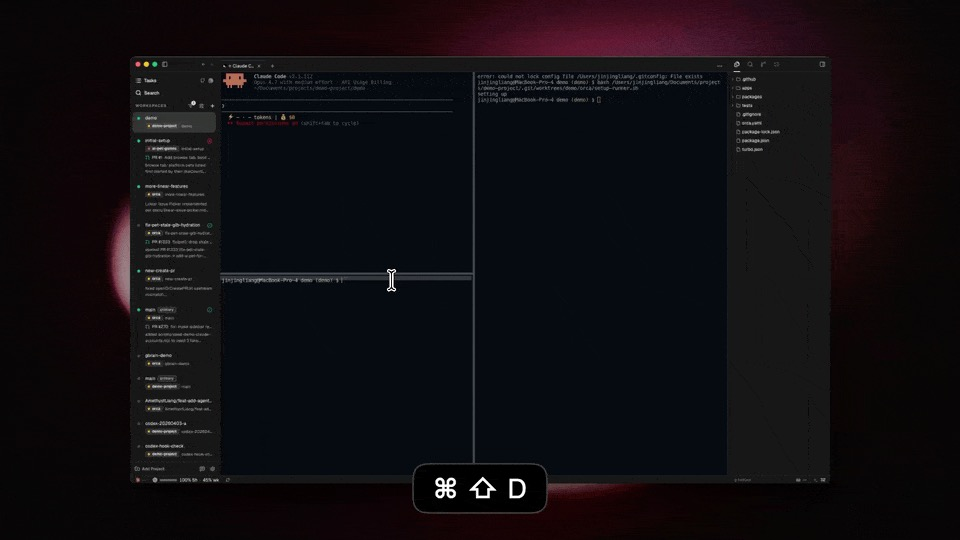
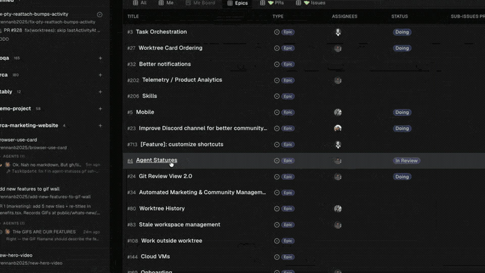
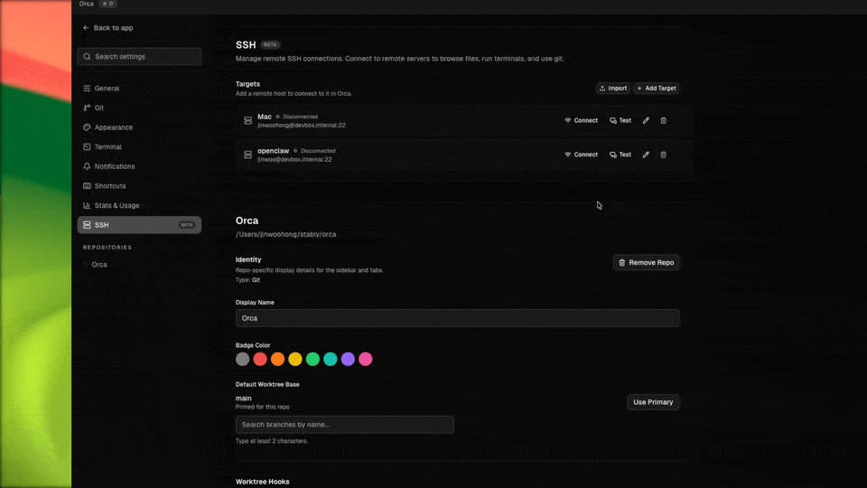
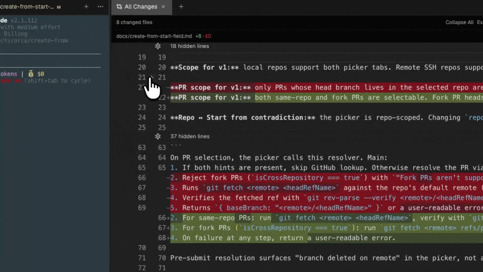
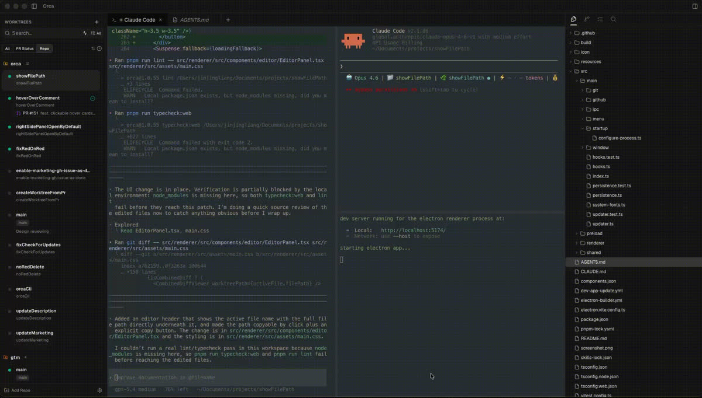
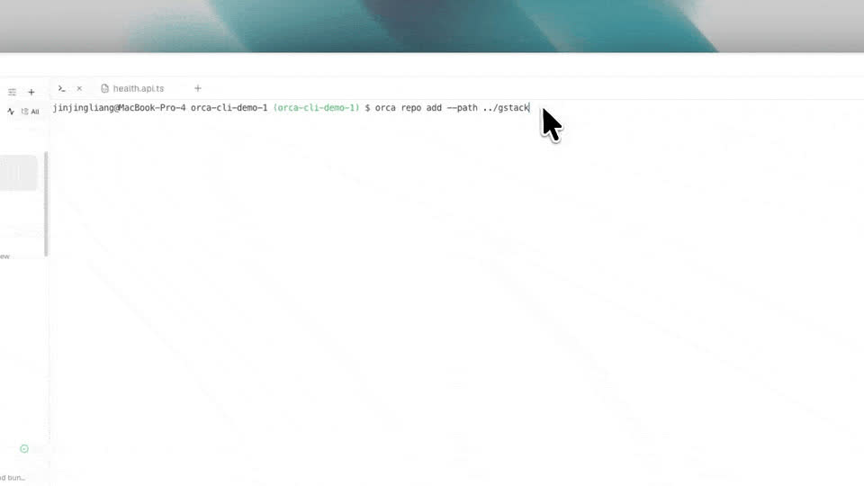

<h1 align="center">
  <a href="https://onOrca.dev"></a> Girra
</h1>

<p align="center">
  <a href="https://github.com/stablyai/orca"></a>
  <a href="https://github.com/stablyai/orca/releases"></a>
  
  <a href="https://discord.gg/fzjDKHxv8Q"></a>
  <a href="https://x.com/orca_build"></a>
  
</p>

<p align="center">
  <sub><a href="../../README.md">English</a> · <a href="README.ja.md">日本語</a> · <a href="README.ko.md">한국어</a> · <a href="README.es.md">Español</a> · <a href="README.fr.md">Français</a> · <a href="README.pt.md">Português</a></sub>
</p>

<p align="center">
  <strong>面向 100x 构建者的 AI 编排器。</strong><br/>
  并排运行 Claude Code、OpenCode 或 Pi — 每个都在自己的 worktree 中运行，并在一个地方统一跟踪。
</p>

<h3 align="center"><a href="https://onorca.dev/download"><ins>下载 Girra</ins></a></h3>

<p align="center">
  
</p>

## 特性

<table>
<tr>
<td width="50%" valign="middle">

### 并行 Worktree

把一个提示同时分发给五个智能体，每个都在自己隔离的 git worktree 中运行 — 比较结果，合并最佳方案。

[文档 →](https://www.onorca.dev/docs/model/worktrees)

</td>
<td width="50%">
  <a href="https://www.onorca.dev/docs/model/worktrees"><picture><source srcset="../assets/feature-wall/parallel-worktrees.gif" type="image/gif"></picture></a>
</td>
</tr>
<tr>
<td width="50%" valign="middle">

### 终端分屏

Ghostty 级终端，支持 WebGL 渲染、无限分屏，以及重启后依然保留的滚动历史。

[文档 →](https://www.onorca.dev/docs/terminal)

</td>
<td width="50%">
  <a href="https://www.onorca.dev/docs/terminal"><picture><source srcset="../assets/feature-wall/terminal-splits.gif" type="image/gif"></picture></a>
</td>
</tr>
<tr>
<td width="50%" valign="middle">

### 设计模式

在真实的 Chromium 窗口中点击任意 UI 元素，把它的 HTML、CSS 和裁剪好的截图直接发送到智能体的提示中。

[文档 →](https://www.onorca.dev/docs/browser/design-mode)

</td>
<td width="50%">
  <a href="https://www.onorca.dev/docs/browser/design-mode"><picture><source srcset="../assets/feature-wall/design-mode.gif" type="image/gif"></picture></a>
</td>
</tr>
<tr>
<td width="50%" valign="middle">

### GitHub &amp; Linear 原生集成

在应用内浏览 PR、issue 和项目看板 — 从任意任务打开 worktree，无需切换上下文即可完成评审。

[文档 →](https://www.onorca.dev/docs/review/linear)

</td>
<td width="50%">
  <a href="https://www.onorca.dev/docs/review/linear"><picture><source srcset="../assets/feature-wall/github-linear.gif" type="image/gif"></picture></a>
</td>
</tr>
<tr>
<td width="50%" valign="middle">

### SSH Worktree

在高性能远程机器上运行智能体，完整支持文件编辑、git 和终端 — 自动重连与端口转发一应俱全。

[文档 →](https://www.onorca.dev/docs/ssh)

</td>
<td width="50%">
  <a href="https://www.onorca.dev/docs/ssh"><picture><source srcset="../assets/feature-wall/ssh-worktrees.gif" type="image/gif"></picture></a>
</td>
</tr>
<tr>
<td width="50%" valign="middle">

### 标注 AI Diff

在任意 diff 行上添加评论并发回给智能体 — 评审、编辑、提交，全程无需离开 Girra。

[文档 →](https://www.onorca.dev/docs/review/annotate-ai-diff)

</td>
<td width="50%">
  <a href="https://www.onorca.dev/docs/review/annotate-ai-diff"><picture><source srcset="../assets/feature-wall/annotate-diff.gif" type="image/gif"></picture></a>
</td>
</tr>
<tr>
<td width="50%" valign="middle">

### 拖文件给智能体

VS Code 的编辑器，处处自动保存 — 把文件或图片直接拖入智能体提示。

[文档 →](https://www.onorca.dev/docs/editing/file-explorer)

</td>
<td width="50%">
  <a href="https://www.onorca.dev/docs/editing/file-explorer"><picture><source srcset="../assets/feature-wall/file-drag.gif" type="image/gif"></picture></a>
</td>
</tr>
<tr>
<td width="50%" valign="middle">

### Girra CLI

智能体也能驱动 Girra — 用 `orca worktree create`、`snapshot`、`click` 和 `fill` 把每个工作流脚本化。

[文档 →](https://www.onorca.dev/docs/cli/overview)

</td>
<td width="50%">
  <a href="https://www.onorca.dev/docs/cli/overview"><picture><source srcset="../assets/feature-wall/orca-cli.gif" type="image/gif"></picture></a>
</td>
</tr>
</table>

**开箱即用的还有：**

- **[快速打开](https://www.onorca.dev/docs/model/quick-open)** — 在 worktree、文件、智能体、命令和仓库上下文之间搜索，不打断你的心流。
- **[账号切换与用量追踪](https://www.onorca.dev/docs/agents/usage-tracking)** — 查看 Claude 的用量与限额重置时间，并且无需重新登录即可热切换账号。
- **[丰富仓库预览](https://www.onorca.dev/docs/editing/markdown)** — 在工作区中预览 Markdown、图片、PDF 和仓库文档。
- **[Computer Use](https://www.onorca.dev/docs/cli/computer-use)** — 当工作流需要真实交互时，让智能体操作桌面应用和可见 UI。
- **[通知与未读状态](https://www.onorca.dev/docs/notifications)** — 第一时间知道智能体何时完成或需要关注，并可将会话标记为未读，稍后再回来处理。
- **还有很多很多** — 我们每天发布新功能，这个列表永远跟不上。[更新日志](https://github.com/stablyai/orca/releases)才是真正的功能列表。

---

## 支持的智能体

适配**任何 CLI 智能体** — 只要能在终端里运行，就能在 Girra 里运行。

<p>
  <a href="https://docs.anthropic.com/claude/docs/claude-code"><kbd> Claude Code</kbd></a> &nbsp;
  <a href="https://opencode.ai/docs/cli/"><kbd> OpenCode</kbd></a> &nbsp;
  <a href="https://pi.dev"><kbd> Pi</kbd></a> &nbsp;
  <kbd>+ 任何 CLI 智能体</kbd>
</p>

---

## 安装

### 桌面端 — macOS、Windows、Linux

- **[从 onOrca.dev 下载](https://onorca.dev/download)**
- 或直接获取安装包：[macOS Apple Silicon](https://github.com/stablyai/orca/releases/latest/download/orca-macos-arm64.dmg) · [macOS Intel](https://github.com/stablyai/orca/releases/latest/download/orca-macos-x64.dmg) · [Windows (.exe)](https://github.com/stablyai/orca/releases/latest/download/orca-windows-setup.exe) · [Linux AppImage](https://github.com/stablyai/orca/releases/latest/download/orca-linux.AppImage) · [全部构建](https://github.com/stablyai/orca/releases/latest)

_也可以通过包管理器安装：_

```bash
# macOS (Homebrew)
brew install --cask stablyai/orca/orca

# Arch Linux (AUR) — or stably-orca-git to build from source
yay -S stably-orca-bin
```

---

## 社区与支持

- **Discord:** 加入 **[Discord](https://discord.gg/fzjDKHxv8Q)** 社区。
- **Twitter / X:** 关注 **[@orca_build](https://x.com/orca_build)** 获取更新和公告。
- **微信:** 扫码加入 Orca 社区微信第 8 群。第 8 群可能已满，如遇这种情况请扫描第 9 群二维码。

  &nbsp;&nbsp;

- **反馈与想法:** 我们发布很快。缺少什么功能？[提交功能请求](https://github.com/stablyai/orca/issues)。
- **支持我们:** 给这个仓库点 [Star](https://github.com/stablyai/orca)，关注我们的日常发布。

---

## 开发

想要贡献代码或在本地运行？请参阅我们的 [CONTRIBUTING.md](../../.github/CONTRIBUTING.md) 指南。

<a href="https://github.com/stablyai/orca/graphs/contributors">
  
</a>

## 许可证

Girra 是自由且开源的软件，遵循 [MIT 许可证](../../LICENSE)。
